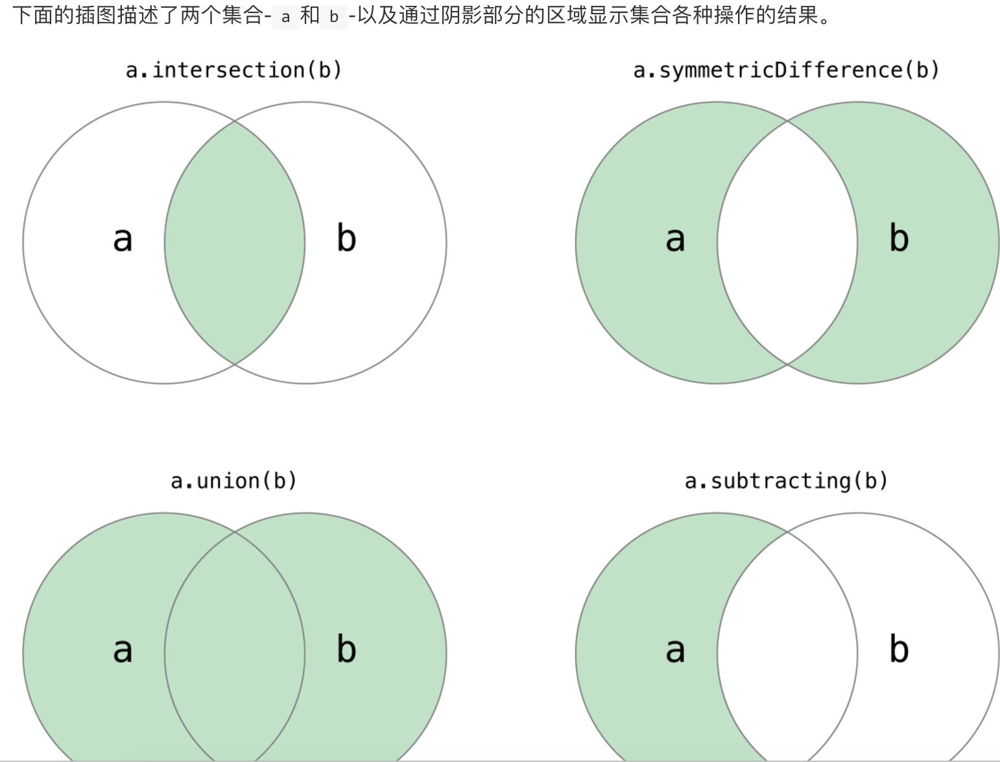

# swift tips

\[TOC\]

### Swift获取命名空间

```text
##1. 获取命名空间 
let spaceName = NSBundle.mainBundle().infoDictionary!["CFBundleExecutable"] as! String
```

## 2. 比较元组大小会按照从左到右、逐值比较的方式，直到发现有两个值不等时停止。如果所有的值都相等，那么这一对元组我们就称它们是相等的。例如：

```c
(1, "zebra") < (2, "apple") //true 因为1<2
(3, "apple") < (3, "bird") // true apple < bird
(4, "dog") == (4, "dog") // true
```

> Swift 标准库只能比较七个以内元素的元组比较函数。如果你的元组元素超过七个时，你需要自己实现比较运算符

## 3.  空合运算符 （a ?? b）

空合运算符（a ?? b）将对可选类型 a 进行空判断，如果 a 包含一个值就进行解封，否则就返回一个默认值 b。表达式 a 必须是 Optional 类型。默认值 b 的类型必须要和 a 存储值的类型保持一致。

```swift
let defaultStr = "red"
var useDefinedStr:String?
var toUse = useDefinedStr ?? defaultStr //结果： "red"
```

## 4. 字符串索引

使用startIndex属性可以获取一个String的第一个Character的索引。使用endIndex属性可以获取最后一个Character的后一个位置的索引。因此，endIndex属性不能作为一个字符串的有效下标。如果String是空串，startIndex和endIndex是相等的。

## 5. 集合操作， 只适应于 set



* 使用intersection\(\_:\)方法根据两个集合中都包含的值创建的一个新的集合。
* 使用symmetricDifference\(\_:\)方法根据在一个集合中但不在两个集合中的值创建一个新的集合。
* 使用union\(\_:\)方法根据两个集合的值创建一个新的集合。
* 使用subtracting\(\_:\)方法根据不在该集合中的值创建一个新的集合。

```swift
let oddDigits: Set = [1, 3, 5, 7, 9]
let evenDigits: Set = [0, 2, 4, 6, 8]
let singleDigitPrimeNumbers: Set = [2, 3, 5, 7]

oddDigits.union(evenDigits).sorted()
// [0, 1, 2, 3, 4, 5, 6, 7, 8, 9]
oddDigits.intersection(evenDigits).sorted()
// []
oddDigits.subtracting(singleDigitPrimeNumbers).sorted()
// [1, 9]
oddDigits.symmetricDifference(singleDigitPrimeNumbers).sorted()
// [1, 2, 9]
```

## 6. 控制转移语句

* continue

  > continue语句告诉一个循环体立刻停止本次循环，重新开始下次循环。就好像在说“本次循环我已经执行完了”，但是并不会离开整个循环体。

* Break

  > break语句会立刻结束整个控制流的执行。当你想要更早的结束一个switch代码块或者一个循环体时，你都可以使用break语句。

* fallthrough \(swift专有\)

  ```swift
  let integerToDescribe = 5
  var description = "The number \(integerToDescribe) is"
  switch integerToDescribe {
  case 2, 3, 5, 7, 11, 13, 17, 19:
    description += " a prime number, and also"
    fallthrough
  default:
    description += " an integer."
  }
  print(description)
  // 输出 "The number 5 is a prime number, and also an integer."
  ```

  > 注意： fallthrough关键字不会检查它下一个将会落入执行的 case 中的匹配条件。fallthrough简单地使代码继续连接到下一个 case 中的代码，这和 C 语言标准中的switch语句特性是一样的。

* 带标签的语句

给循环体带标签，这样可以在循环体内部的 switch语句中来中断循环体或者继续下一次循环，否则只会中断 switch语句

```text
gameLoop: while square != finalSquare {
    diceRoll += 1
    if diceRoll == 7 { diceRoll = 1 }
    switch square + diceRoll {
    case finalSquare:
        // 骰子数刚好使玩家移动到最终的方格里，游戏结束。
        break gameLoop
    case let newSquare where newSquare > finalSquare:
        // 骰子数将会使玩家的移动超出最后的方格，那么这种移动是不合法的，玩家需要重新掷骰子
        continue gameLoop
    default:
        // 合法移动，做正常的处理
        square += diceRoll
        square += board[square]
    }
}
print("Game over!")
```

> 注意：如果上述的break语句没有使用gameLoop标签，那么它将会中断switch语句而不是while循环。使用gameLoop标签清晰的表明了break想要中断的是哪个代码块。 同时请注意，当调用continue gameLoop去跳转到下一次循环迭代时，这里使用gameLoop标签并不是严格必须的。因为在这个游戏中，只有一个循环体，所以continue语句会影响到哪个循环体是没有歧义的。然而，continue语句使用gameLoop标签也是没有危害的。这样做符合标签的使用规则，同时参照旁边的break gameLoop，能够使游戏的逻辑更加清晰和易于理解。

## 7. 闭包

* 全局函数是一个有名字但不会捕获任何值的闭包
* 嵌套函数是一个有名字并且可以捕获其封闭函数域内值的闭包
* 闭包表达式是一个利用轻量级语法缩写的可以捕获其上下文中变量或常量值的匿名闭包

> 闭包和函数都是引用类型

## 7.1 逃匿闭包

当一个闭包作为参数传到一个函数中，但是这个闭包在函数返回之后才被执行，我们称该闭包从函数中逃逸。当你定义接受闭包作为参数的函数时，你可以在参数名之前标注 @escaping，用来指明这个闭包是允许“逃逸”出这个函数的。

## 8.枚举 enum

> 与 C 和 Objective-C 不同，Swift 的枚举成员在被创建时不会被赋予一个默认的整型值。

## 9. 类和结构体

> 注意 结构体总是通过被复制的方式在代码中传递，不使用引用计数。

1. 结构体和枚举都是值类型（需要开辟新的空间来存放拷贝的值。改变拷贝的值不行影响原值），而类是引用类型（相当于拷贝指针，指向同一内存地址，一处更改，所有都更改）

   **10. 恒等运算符**

2. 等价于 ===
3. 不等价于 !==

   > “等价于”表示两个类类型（class type）的常量或者变量引用同一个类实例。 “等于”表示两个实例的值“相等”或“相同”，判定时要遵照设计者定义的评判标准，因此相对于“相等”来说，这是一种更加合适的叫法。

## 11. 计算属性和属性观察器

使用属性观察器的时候，该属性必须已经初始化。

## 12. 类属性和类方法

实例属性属于一个特定类型的实例，每创建一个实例，实例都拥有属于自己的一套属性值，实例之间的属性相互独立。 也可以为类型本身定义属性，无论创建了多少个该类型的实例，这些属性都只有唯一一份。这种属性就是类型属性。

> 使用关键字 static 来定义类型属性。在为类定义计算型类型属性时，可以改用关键字 class 来支持子类对父类的实现进行重写。
>
> \`\`\`swift class SomeClass{

```text
static var storedTypeProperty = "Some value"
static var computedTypeProperty: Int{
    return 27
}

class  func someTypeMethod() {
    print("Class Methiod")
}
```

}

```text
> 在类型方法的方法体（body）中，self指向这个类型本身，而不是类型的某个实例。这意味着你可以用self来消除类型属性和类型方法参数之间的歧义（类似于我们在前面处理实例属性和实例方法参数时做的那样）。

##13. 下标
下标可以定义在类， 结构体和枚举中

```swift
struct Matrix{
    let rows: Int, columns: Int
    var grid:[Double]
    init(rows: Int, columns: Int) {
        self.rows = rows
        self.columns = columns
        grid = Array (repeating: 0.0, count: rows*columns)
    }

    func indexIsValidForRow(row: Int, column: Int) -> Bool {
        return row>=0 && row < rows && column >= 0 && column < columns
    }

    subscript(row: Int, column: Int) -> Double{
        get{
            assert(indexIsValidForRow(row: row, column: column), "Index out of range")
            return grid[(row * column) + column]
        }

        set{
            assert(indexIsValidForRow(row: row, column: column), "Index out of range")
            grid[(row*column)+column] = newValue
        }
    }

}

var matrix = Matrix (rows: 2, columns: 2)
matrix[0,1] = 1.5
matrix[1,0] = 3.2
let someValue = matrix[0,1]
```

## 14. 类的构造器

* 规则 1

  指定构造器必须调用其直接父类的的指定构造器。

* 规则 2

  便利构造器必须调用同类中定义的其它构造器。

* 规则 3

  便利构造器必须最终导致一个指定构造器被调用。

  > 指定构造器必须总是向上代理 便利构造器必须总是横向代理

swift 的类构造器的安全检查 1. 指定构造器必须保证它`所在类引入的所有属性都必须先初始化完成`，`之后`才能将其它构造任务`向上代理`给父类中的构造器。 如上所述，一个对象的内存只有在其所有存储型属性确定之后才能完全初始化。为了满足这一规则，指定构造器必须保证它所在类引入的属性在它往上代理之前先完成初始化。 2. 指定构造器`必须先向上代理调用父类构造器`，然后再为`继承`的属性设置新值。如果没这么做，指定构造器赋予的新值将被父类中的构造器所覆盖。 3. 便利构造器`必须先代理调用同一类中的其它构造器`，`然后再为任意属性赋新值`。如果没这么做，便利构造器赋予的新值将被同一类中其它指定构造器所覆盖。 4. 构造器在第一阶段构造完成之前，不能调用任何实例方法，不能读取任何实例属性的值，不能引用self作为一个值。 类实例在第一阶段结束以前并不是完全有效的。只有第一阶段完成后，该实例才会成为有效实例，才能访问属性和调用方法。 以下是两段式构造过程中基于上述安全检查的构造流程展示： 4.1 阶段1：

* 某个指定构造器或便利构造器被调用。
* 完成新实例内存的分配，但此时内存还没有被初始化。
* 指定构造器确保其所在类引入的所有存储型属性都已赋初值。存储型属性所属的内存完成初始化。
* 指定构造器将调用父类的构造器，完成父类属性的初始化。
* 这个调用父类构造器的过程沿着构造器链一直往上执行，直到到达构造器链的最顶部。
* 当到达了构造器链最顶部，且已确保所有实例包含的存储型属性都已经赋值，这个实例的内存被认为已经完全初始化。此时阶段 1 完成。

  4.2 阶段2：

* 从顶部构造器链一直往下，每个构造器链中类的指定构造器都有机会进一步定制实例。构造器此时可以访问self、修改它的属性并调用实例方法等等。
* 最终，任意构造器链中的便利构造器可以有机会定制实例和使用self。

  **14.1 构造器的自动继承**

  继承规则

* 规则 1 如果子类没有定义任何指定构造器，它将自动继承所有父类的指定构造器。
* 规则 2 如果子类提供了```所有``父类指定构造器``的实现```——无论是通过规则 1 继承过来的，还是提供了自定义实现——它将自动继承所有父类的便利构造器。 即使你在子类中添加了更多的便利构造器，这两条规则仍然适用。

  **14.2 可失败构造器**

  \`\`\`swift

// init前面+“？”，表示可构造失败 struct Animal{

```text
let species: String
init?(species: String) {
    if species.isEmpty {
        return nil
    }
    self.species = species
}
```

}

let someCreature = Animal \(species: ""\) if let giraffe = someCreature { print\("yes"\) }

```text
> 带原始值的枚举类型的可失败构造器
```swift
enum TemperatureUnit: Character{
    case Kelvin = "K", Celsius = "C", Fahrenheit = "F"    
}

let fahrenheitUnit = TemperatureUnit (rawValue: "X")
if fahrenheitUnit != nil {
    print("YES")
}
```

## 15. 通过闭包或函数设置属性的默认值

```swift
struct CheckerBoard{

    let boardColors: [Bool] = {
        var temporaryBoard = [Bool]()
        var isBlack = false
        for i in 1...8 {
            for j in 1...8 {
                temporaryBoard.append(isBlack)
                isBlack = !isBlack
            }
            isBlack = !isBlack
        }

        return temporaryBoard
    }()

    func squareIsBlackAtRow(row: Int, column: Int) -> Bool {
        return boardColors[(row*8) + column]
    }
}
```

注意闭包结尾的大括号后面接了一对空的小括号。这用来告诉 Swift 立即执行此闭包。如果你忽略了这对括号，相当于将闭包本身作为值赋值给了属性，而不是将闭包的返回值赋值给属性。

> 注意 如果你使用闭包来初始化属性，请记住在闭包执行时，实例的其它部分都还没有初始化。这意味着你不能在闭包里访问其它属性，即使这些属性有默认值。同样，你也不能使用隐式的self属性，或者调用任何实例方法。

## 16. 解决实例之间的循环强引用

Swift 提供了两种办法用来解决你在使用类的属性时所遇到的循环强引用问题：弱引用（weak reference）和无主引用（unowned reference）。

### 16.1 弱引用

弱引用不会对其引用的实例保持强引用，因而不会阻止 ARC 销毁被引用的实例。这个特性阻止了引用变为循环强引用。声明属性或者变量时，在前面加上weak关键字表明这是一个弱引用。

因为弱引用不会保持所引用的实例，即使引用存在，实例也有可能被销毁。因此，ARC 会在引用的实例被销毁后自动将其赋值为nil。并且因为弱引用可以允许它们的值在运行时被赋值为nil，所以它们会被定义为可选类型变量，而不是常量。

你可以像其他可选值一样，检查弱引用的值是否存在，你将永远不会访问已销毁的实例的引用。

### 16.2 无主引用

和弱引用类似，无主引用不会牢牢保持住引用的实例。和弱引用不同的是，无主引用在其他实例有相同或者更长的生命周期时使用。你可以在声明属性或者变量时，在前面加上关键字unowned表示这是一个无主引用。

无主引用通常都被期望拥有值。不过 ARC 无法在实例被销毁后将无主引用设为nil，因为非可选类型的变量不允许被赋值为nil。

> 重要 使用无主引用，你必须确保引用始终指向一个未销毁的实例。 如果你试图在实例被销毁后，访问该实例的无主引用，会触发运行时错误。

## 17. Extensions  扩展

swift 中的扩展可以：

* 添加计算型属性和计算型类型属性
* 定义实例方法和类型方法
* 提供新的构造器
* 定义下标
* 定义和使用新的嵌套类型
* 使一个已有类型符合某个协议在 Swift 中，你甚至可以对协议进行扩展，提供协议要求的实现，或者添加额外的功能，从而可以让符合协议的类型拥有这些功能。

  > 注意 扩展可以为一个类型添加新的功能，但是不能重写已有的功能。

* 扩展能为类添加新的便利构造器，但是它们不能为类添加新的指定构造器或析构器。指定构造器和析构器必须总是由原始的类实现来提供。

## 18. 协议 protocol

### 18.1 协议作为类型

协议可以像其他普通类型一样使用，使用场景如下：

* 作为函数、方法或构造器中的参数类型或返回值类型
* 作为常量、变量或属性的类型
* 作为数组、字典或其他容器中的元素类型

  \`\`\`swift // 协议 protocol RandomNumberGenerator {

  func random\(\) -&gt; Double } // 遵循协议的类 class linearCongruentialGenerator: RandomNumberGenerator{

  var lastRandom = 42.0 let m = 139968.0 let a = 3877.0 let c = 29573.9 func random\(\) -&gt; Double { lastRandom = \(lastRandom \* a + c\).truncatingRemainder\(dividingBy: m\) return lastRandom / m } }

// 协议作为类型传递 class Dice{

```text
let sides: Int
let generator: RandomNumberGenerator
init(sides: Int, generator: RandomNumberGenerator) {
    self.sides = sides
    self.generator = generator
}

func roll() -> Int {
    return Int(generator.random() * Double(sides)) + 1
}
```

}

var d6 = Dice \(sides: 6, generator: linearCongruentialGenerator\(\)\)

```text
generator 属性的类型为 RandomNumberGenerator，因此任何遵循了 RandomNumberGenerator 协议的类型的实例都可以赋值给 generator，除此之外并无其他要求。

###18.2 类类型专属协议
你可以在协议的继承列表中，通过添加 class 关键字来限制协议只能被类类型遵循，而结构体或枚举不能遵循该协议。class 关键字必须第一个出现在协议的继承列表中，在其他继承的协议之前：
```swift
protocol SomeClassOnlyProtocol: class, SomeInheritedProtocol {
    // 这里是类类型专属协议的定义部分
}
```

在以上例子中，协议 SomeClassOnlyProtocol 只能被类类型遵循。如果尝试让结构体或枚举类型遵循该协议，则会导致编译错误。

### 18.3 检查协议一致性

* is 用来检查实例是否符合某个协议，若符合则返回 true，否则返回 false。
* as? 返回一个可选值，当实例符合某个协议时，返回类型为协议类型的可选值，否则返回 nil。
* as! 将实例强制向下转换到某个协议类型，如果强转失败，会引发运行时错误。

### 18.4 提供默认实现

可以通过协议扩展来为协议要求的属性、方法以及下标提供默认的实现。如果遵循协议的类型为这些要求提供了自己的实现，那么这些自定义实现将会替代扩展中的默认实现被使用。

### 18.5 为协议扩展添加限制条件

在扩展协议的时候，可以指定一些限制条件，只有遵循协议的类型满足这些限制条件时，才能获得协议扩展提供的默认实现。这些限制条件写在协议名之后，使用 where 子句来描述，正如Where子句中所描述的。

```swift
//可以扩展 CollectionType 协议，但是只适用于集合中的元素遵循了 SomeRepresentable 协议的情况
extension Collection where Iterator.Element: SomeRepresentable{

    var textualDescription: String {
        let itemsAsText = self.map { $0.textualDescription}
        return "[" + itemsAsText.joined(separator: ",") + "]"

    }
}
```

> 注意 如果多个协议扩展都为同一个协议要求提供了默认实现，而遵循协议的类型又同时满足这些协议扩展的限制条件，那么将会使用限制条件最多的那个协议扩展提供的默认实现。

## 19. 泛型

```swift
func swapTwoValues<U>(_ a: inout U, _ b: inout U){

    let temporaryA = a
    a = b
    b = temporaryA
}
```

泛型函数特征： 这个函数的泛型版本使用了占位类型名（在这里用字母 T 来表示）来代替实际类型名（例如 Int、String 或 Double）。占位类型名没有指明 T 必须是什么类型，但是它指明了 a 和 b 必须是同一类型 T，无论 T 代表什么类型。只有 swapTwoValues\(_:_:\) 函数在调用时，才能根据所传入的实际类型决定 T 所代表的类型。 另外一个不同之处在于这个泛型函数名（swapTwoValues\(_:_:\)）后面跟着占位类型名（T），并用尖括号括起来（）。这个尖括号告诉 Swift 那个 T 是 swapTwoValues\(_:_:\) 函数定义内的一个占位类型名，因此 Swift 不会去查找名为 T 的实际类型。

### 19.1 类型约束

你可以在一个类型参数名后面放置一个类名或者协议名，并用冒号进行分隔，来定义类型约束，它们将成为类型参数列表的一部分。对泛型函数添加类型约束的基本语法如下所示（作用于泛型类型时的语法与之相同）：

```swift
func someFunction<T: SomeClass, U: SomeProtocol>(someT: T, someU: U) {
    // 这里是泛型函数的函数体部分
}
```

上面这个函数有两个类型参数。第一个类型参数 T，有一个要求 T 必须是 SomeClass 子类的类型约束；第二个类型参数 U，有一个要求 U 必须符合 SomeProtocol 协议的类型约束。

## 20. 关联类型

定义一个协议时，有的时候声明一个或多个关联类型作为协议定义的一部分将会非常有用。关联类型为协议中的某个类型提供了一个占位名（或者说别名），其代表的实际类型在协议被采纳时才会被指定。你可以通过 associatedtype 关键字来指定关联类型。

## 21. 运算符重载

```swift
// 中缀运算符重载
struct Vector2D {
    var x = 0.0, y = 0.0
}

extension Vector2D {
    static func + (left: Vector2D, right: Vector2D) -> Vector2D {
        return Vector2D(x: left.x + right.x, y: left.y + right.y)
    }
}
```

### 21.1 前缀和后缀运算符

```swift
extension Vector2D{

    static prefix func -(vector: Vector2D) -> Vector2D{
        return Vector2D (x: -vector.x, y: -vector.y)
    }
}

let prefixOperation = -vector
```

### 21.2 等价运算符

自定义的类和结构体没有对等价运算符进行默认实现，等价运算符通常被称为“相等”运算符（==）与“不等”运算符（!=）。对于自定义类型，Swift 无法判断其是否“相等”，因为“相等”的含义取决于这些自定义类型在你的代码中所扮演的角色。

为了使用等价运算符能对自定义的类型进行判等运算，需要为其提供自定义实现，实现的方法与其它中缀运算符一样：

```swift
extension Vector2D{

    static func == (left: Vector2D, right: Vector2D) -> Bool{

        return (left.x == right.x) && (left.y == right.y)
    }

    static func != (left: Vector2D, right: Vector2D) -> Bool{
        return !(left == right)
    }
}

let twoThree = Vector2D(x: 2.0, y: 3.0)
let anotherTwoThree = Vector2D(x: 2.0, y: 3.0)
if twoThree == anotherTwoThree {
    print("These two vectors are equivalent.")
}
```

### 21.3 自定义运算符

除了实现标准运算符，在 Swift 中还可以声明和实现自定义运算符。可以用来自定义运算符的字符列表： 自定义运算符可以由以下其中之一的 ASCII 字符 /、=、 -、+、!、\*、%、&lt;、&gt;、&、\|、^、? 以及 ~，或者后面语法中规定的任一个 Unicode 字符（其中包含了数学运算符、零散符号\(Miscellaneous Symbols\) 以及印刷符号 \(Dingbats\) 之类的 Unicode 块）开始。在第一个字符之后，允许使用组合型 Unicode 字符。

您也可以以点号 \(.\) 开头来定义自定义运算符。这些运算符可以包含额外的点，例如 .+.。如果某个运算符不是以点号开头的，那么它就无法再包含另外的点号了。例如，+.+ 就会被看作为一个 + 运算符后面跟着一个 .+ 运算符。

虽然您可以用问号 ? 来自定义运算符，但是这个运算符不能只包含单独的一个问号。此外，虽然运算符可以包含一个惊叹号 !，但是前缀运算符不能够以问号或者惊叹号开头。

> 注意 以下这些标记 =、-&gt;、//、/_、_/、.、&lt;（前缀运算符）、&、?、?（中缀运算符）、&gt;（后缀运算符）、! 、? 是被系统保留的。这些符号不能被重载，也不能用于自定义运算符。

运算符两侧的空白被用来区分该运算符是否为前缀运算符、后缀运算符或二元运算符。规则总结如下：

如果运算符两侧都有空白或两侧都无空白，将被看作二元运算符。例如：a+++b 和 a +++ b 当中的 +++ 运算符会被看作二元运算符。 如果运算符只有左侧空白，将被看作一元前缀运算符。例如 a +++b 中的 +++ 运算符会被看做是一元前缀运算符。 如果运算符只有右侧空白，将被看作一元后缀运算符。例如 a+++ b 中的 +++ 运算符会被看作是一元后缀运算符。 如果运算符左侧没有空白并紧跟 .，将被看作一元后缀运算符。例如 a+++.b 中的 +++ 运算符会被视为一元后缀运算符（即上式被视为 a+++ .b 而不是 a +++ .b）。 鉴于这些规则，运算符前的字符 \(、\[ 和 {，运算符后的字符 \)、\] 和 }，以及字符 ,、; 和 : 都被视为空白。

新的运算符要使用 operator 关键字在全局作用域内进行定义，同时还要指定 prefix、infix 或者 postfix 修饰符：

```swift
prefix operator +++
```

## 22 表达式

### 22.1 选择器表达式

选择器表达式

```swift
let selectorForPropertyGetter = #selector(getter: SomeClass.property)
```

当为属性的getter创建选择器时,属性名可以是变量属性或者常量属性的引用。但是当为属性的setter创建选择器时,属性名只可以是对变量属性的引用。

## 23. swift中的指针

### 23.1 作为数组使用的参数指针

在C语言中，数组和指针的联系十分紧密，而Swift允许数组能够作为指针使用，从而与基于数组的C语言API协同工作更加简单。一个固定的数组可以使用一个常量指针直接传递，一个变化的数组可以用&运算符将一个非常量指针传递。就和输入/输出参数指针一样。举例来说：我们可以用Accelerate框架中的vDSP\_vadd方法让两个数组a和b相加，并将结果写入第三个数组result。

```swift
import Accelerate

let a: [Float] = [1,2,3,4]
let b: [Float] = [0.5,0.25,0.125,0.0625]
var result: [Float] = [0,0,0,0]

/**
    第一个参数：数组1
    第二个参数：数组1中的元素计算方式，1-> 逐个计算，2->以增量2计算，
            比如：如果填2，那么第二个计算的元素就是 2
    第三个参数：数组2
    第四个参数：数组2中的元素计算方式
    第5个参数：结果数组
    第6个参数：结果数组的长度
 */
vDSP_vadd(a, 1, b, 1, &result, 1, 4)

print(result) // [1.5, 2.25, 3.125, 4.0625]


vDSP_vadd(a, 2, b, 1, &result, 1, 4)
print(result) // [1.5, 3.25, 0.125, 0.0625]
```

### 23.2 用作字符串参数的指针

C语言中用cont char_指针来作为传递字符串的基本方式。Swift中的String可以被当作一个无限长度UTF-8编码的const char_指针来传递给方法。举例来说：我们可以直接传递一个字符串给一个标准C和POSIX库方法

```swift
print(result) // [1.5, 3.25, 0.125, 0.0625]

//puts("Hello from libc")
let fd = open("/Users/tongxing/scratch.txt", O_WRONLY|O_CREAT, 0o666)

if fd < 0 {
    perror("could not open /Users/tongxing/scrath.txt")
}else{
    let text = "Hello world"
    write(fd, text, Int(strlen(text)))
    close(fd)

}
```

## 24. swift中的高阶函数：Map,FlatMap,Filter,Reduce

### 24.1 Map

map函数能够被数组调用，它接受一个闭包作为参数，作用于数组中的每个元素。闭包返回一个变换后的元素，接着将所有这些变换后的元素组成一个新的数组

### 24.2 FlatMap

latMap 与 map 不同之处是 flatMap返回后的数组中不存在 nil 同时它会把Optional解包; flatMap 还能把数组中存有数组的数组 一同打开变成一个新的数组 ; flatMap也能把两个不同的数组合并成一个数组 这个合并的数组元素个数是前面两个数组元素个数的乘积

### 24.3 Filter

### 24.4 Reduce

//计算数组array元素的和 //在这里$0和$1的意义不同，$0代表元素计算后的结果，$1代表元素 //10代表初始化值，在这里可以理解为 $0初始值 = 10

```swift
let array1 = [1,2,3,4,5,6,7]
let result3 = array1.reduce(10) {$0 + $1
}

print(result3)
```

